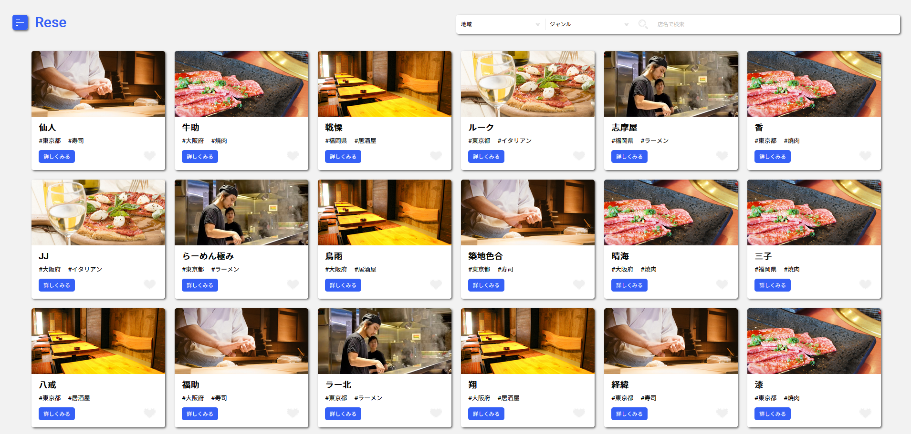
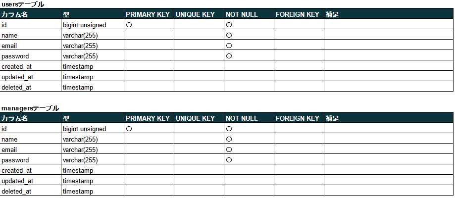
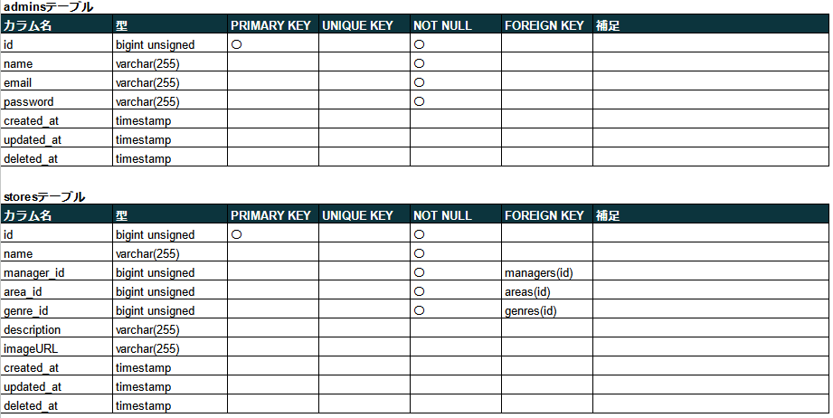
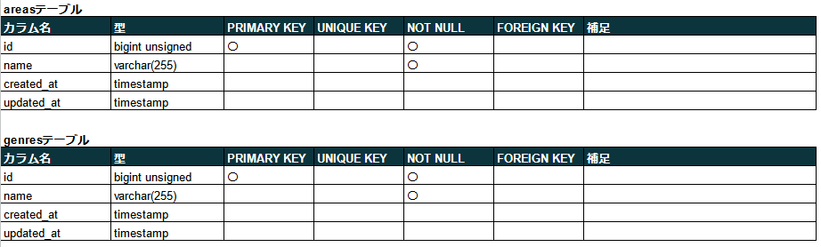
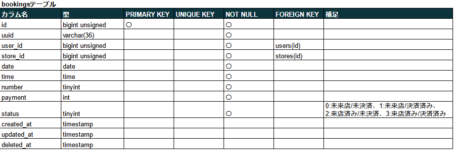
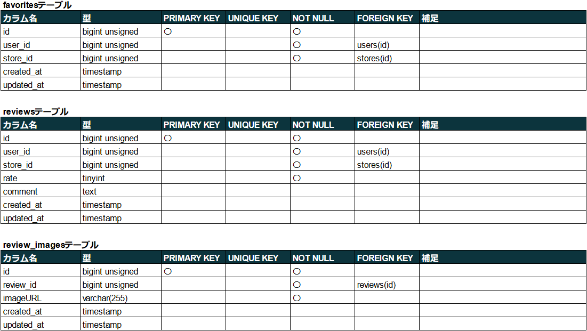
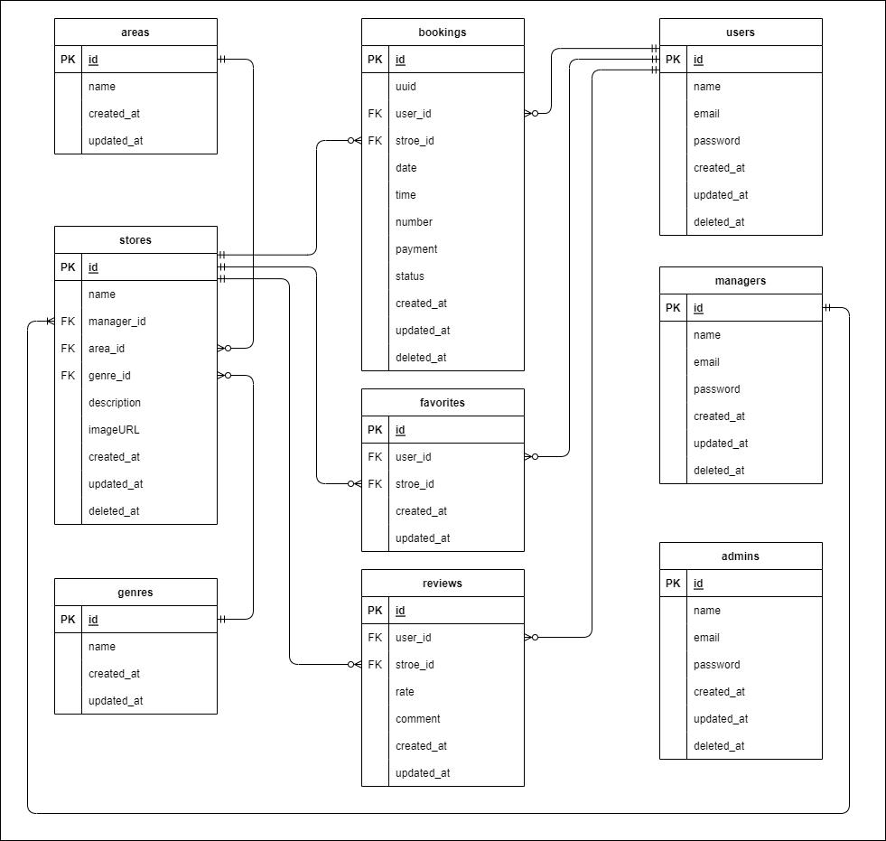

# 飲食店予約アプリケーション

飲食店予約アプリ


## 作成した目的

外部の飲食店予約サービスは手数料を取られるので自社で予約サービスを持ちたい。

## アプリケーション URL

### ローカル環境

- アプリケーション URL：http://localhost/
- phpMyAdmin：http://localhost:8080/
- mailhog：http://localhost:8025/

## 他のリポジトリ

なし

## 機能一覧

| 項目                         | 備考                                                                                                                                                                                                                                                                                                                                                                  |
| ---------------------------- | --------------------------------------------------------------------------------------------------------------------------------------------------------------------------------------------------------------------------------------------------------------------------------------------------------------------------------------------------------------------- |
| 会員登録                     | 会員登録ページから会員登録ができる。                                                                                                                                                                                                                                                                                                                                  |
| ログイン                     | ログインページからログインができる。                                                                                                                                                                                                                                                                                                                                  |
| ログアウト                   | メニューからログアウトを選択することで認証情報をクリアできる。                                                                                                                                                                                                                                                                                                        |
| ユーザー情報取得             | ユーザー情報を取得し、マイページでのユーザー名の表示やユーザー認証を行うことができる。                                                                                                                                                                                                                                                                                |
| ユーザー飲食店お気に入り取得 | マイページでユーザーのお気に入り店舗を取得し一覧表示できる。                                                                                                                                                                                                                                                                                                          |
| ユーザー飲食店予約情報取得   | マイページでユーザーが持つ予約情報を取得し一覧表示できる。<br>ただし、当日以降の予約のみを表示し、過去の予約は表示しない。                                                                                                                                                                                                                                            |
| 飲食店一覧取得               | データベースに登録されている飲食店の一覧を取得・表示できる。                                                                                                                                                                                                                                                                                                          |
| 飲食点詳細取得               | 登録されている飲食店のそれぞれの詳細情報を取得・表示できる。                                                                                                                                                                                                                                                                                                          |
| 飲食店お気に入り追加         | ユーザーごとに飲食店をお気に入り追加することができる。                                                                                                                                                                                                                                                                                                                |
| 飲食店お気に入り削除         | 作成したお気に入り情報を削除することができる。                                                                                                                                                                                                                                                                                                                        |
| 飲食店予約情報追加           | ユーザーごとに飲食店の予約情報を追加することができる。<br>予約日は当日～ 3 か月後までを選択できる。<br>予約時間は 17:00 ~ 21:00 の間で 30 分間隔で選択できる。<br>予約人数は 1 人 ~ 10 人までを選択できる。                                                                                                                                                           |
| 飲食店予約情報削除           | 作成した予約情報を削除することができる。<br>ただし、事前決済実行後は削除不可とする。                                                                                                                                                                                                                                                                                  |
| エリア検索                   | 飲食店をエリアで検索することができる。<br>セレクトボックスでアイテムを選択時に実行。                                                                                                                                                                                                                                                                                  |
| ジャンル検索                 | 飲食店をジャンルで検索することができる。<br>セレクトボックスでアイテムを選択時に実行。                                                                                                                                                                                                                                                                                |
| 店名検索                     | 飲食店を店名で検索することができる。部分検索可。<br>キーワード入力後 Enter キー入力、あるいは虫眼鏡アイコンをクリックで実行。                                                                                                                                                                                                                                         |
| 予約変更機能                 | 予約日時および予約人数をマイページから変更することができる。<br>ただし、事前決済実行後は変更不可とする                                                                                                                                                                                                                                                                |
| 予約変更機能                 | 予約したお店に来店した後に、利用者が店舗を 5 段階評価とコメントができるようにする。<br>レビューは店舗詳細ページからいつでも行えるものとし、多重投稿は不可とする。                                                                                                                                                                                                     |
| バリデーション               | 認証と予約の際にバリデーションをかける。FormRequest を使用する。<br>Users 認証は Fortify を使用。                                                                                                                                                                                                                                                                     |
| レスポンシブデザイン         | タブレット・スマートフォン用のレスポンシブデザインを作成する。<br>ブレイクポイントは 768px とする。最少は 360px を想定。                                                                                                                                                                                                                                              |
| 管理画面                     | 管理者と店舗代表者と利用者の 3 つの権限を作成する。<br>店舗代表者が店舗情報の作成、更新と予約情報の確認ができる管理画面を作成する。<br>管理者側は店舗代表者を作成できる管理画面を作成する。<br>テーブルはそれぞれ別々に作成し、ログインページもそれぞれ用意した。<br>店舗代表者は一人で複数店舗を管理することを想定。                                                 |
| ストレージ                   | 画像をストレージに保存することができる。<br>(rese/storage/app/public/)                                                                                                                                                                                                                                                                                                |
| 認証                         | メールによって本人確認を行うことができる。                                                                                                                                                                                                                                                                                                                            |
| メール送信                   | 管理画面から利用者にお知らせメールを送信することができる。<br>お知らせメール配信ページから利用者あるいは店舗代表者に対しメールを送信できる。                                                                                                                                                                                                                          |
| リマインダー                 | タスクスケジューラーを利用して、予約当日の朝に予約情報のリマインダーを送る。<br>リマインドメールは午前 8：00 の時点で当日の予約を行っているユーザーに対し送信する。<br>タイマーは systemd のタイマーを使用する。                                                                                                                                                      |
| QR コード                    | 利用者が来店した際に店舗側に見せる QR コードを発行し、お店側は照合することができる。<br>利用者側がマイページ上で表示した予約情報データを含む QR コードを店舗側が読み込むことで来店確認を行うことができる。<br>QR コードの読み込みにカメラ機能を使用するため、ローカル環境以外では SSL 化を行い https 接続を行う。                                                     |
| 決済機能                     | Stripe を利用して決済をすることができる。<br>価格は一律 1 人当たり￥ 3,000 とし、予約人数から支払額を算出する。<br>決済は予約完了時、あるいはマイページから行うことができる。<br>(メールアドレス：適当、カード番号：4242 4242 4242 4242、有効期限：切れていない日付、セキュリティコード：適当に 3 桁)<br>決済完了後はシステム上で予約の変更、キャンセルは不可とする。 |
| 口コミ投稿                   | 一般ユーザーは店舗に対し口コミを追加することができる。<br>口コミは「テキスト・星(1~5)・画像」で構成される。                                                                                                                                                                                                                                                           |
| 店舗一覧のソート             | 一般ユーザーは店舗一覧を並び替えることができる。<br>選択肢は「ランダム」、「評価が高い順」、「評価が低い順」。                                                                                                                                                                                                                                                        |
| 店舗データの csv インポート  | 店舗代表者は店舗データを csv ファイルからインポートできる。                                                                                                                                                                                                                                                                                                           |

## 使用技術(実行環境)

- PHP 7.4.9
- Laravel 8.6.12
- MySQL 8.0.35
- nginx 1.21.1
- fortify 1.19.1
- simplesoftwareio/simple-qrcode 4.2
- jsQR 1.4.0
- cashier 13.17.0
- stripe/stripe-php 9.9.0
- league/flysystem 1.1.10
- mailhog

## テーブル設計







## ER 図



## 画面遷移図

### 認証前

.jpg>)

### ユーザー

.jpg>)

### 店舗代表者

.jpg>)

### 管理者

.jpg>)

## 環境構築

### Docker ビルド

1. プロジェクトを取得 (terminal)  
   `git clone {URL}`
2. コンテナの作成、実行 (terminal)  
   `docker-compose up -d --build`

＊ MySQL は、OS によって起動しない場合があるのでそれぞれの PC に合わせて、docker-compose.yml ファイルを編集してください。

### 環境構築

1. PHP コンテナに入る (terminal)  
   `docker-compose exec php bash`
2. ライブラリのインストール (PHP)  
   `composer install`
3. .env.example ファイルから.env を作成し、環境変数を変更(terminal)

   - "docker-compose.yml"を参考に DB の設定を修正
   - 送信元アドレスの値(MAIL_FROM_ADDRESS)に任意の値を入力
   - STRIPE_KEY、STRIPE_SECRET の項目を追加し、Stripe にログインし、開発者向け API キーをそれぞれ入力

4. アプリケーションキーの作成 (PHP)  
   `php artisan key:generate`
5. テーブルの作成 (PHP)  
   `php artisan migrate`
6. ダミーデータの作成 (PHP)  
   `php artisan db:seed`

   - テストユーザー ID  
      email : test@user.com  
      password : password
     (/login)
   - テスト店舗代表者 ID  
      email : test@manager.com  
      password : password
     (/manager/login)
   - テスト管理者 ID  
      email : test@admin.com  
      password : password
     (/admin/login)

7. ストレージディレクトリとのリンクを作成 (PHP)  
   `php artisan storage:link`
8. タイマーファイル(rese/system/laravelTask.timer)の"WorkingDirectory"のパスを環境に合わせて修正  
   プロジェクトファイルまでのフルパスを指定する
9. タイマーの設定ファイルの再読み込み(terminal)  
   `sudo systemctl daemon-reload`
10. タイマーを登録 (terminal)  
    `sudo systemctl enable {プロジェクトディレクトリまでのパス}/rese/system/laravelTask.timer`
    `sudo systemctl enable {プロジェクトディレクトリまでのパス}/rese/system/laravelTask.service`
11. タイマーの実行 (terminal)  
    `sudo systemctl start laravelTask.timer`
12. 実行確認 (terminal)  
    `systemctl list-timers`

## その他

- メニュー部、検索部の英文は分かりやすさを目的に日本語に変更

### 追加実装項目について (2024/05/16)

1. 口コミ機能
   - 手順
     - 口コミ投稿
       1. ユーザー権限でログイン (/login)
       2. 適当な店舗の詳細ページを開く
       3. 口コミが未投稿であれば、店舗詳細分の下に口コミ投稿ページへのリンクが表示される
       4. 口コミ投稿ページでレート、口コミ内容、イメージ画像（任意）を入力し投稿
     - 口コミ編集
       1. ユーザー権限でログイン (/login)
       2. 適当な店舗の詳細ページを開く
       3. 口コミを投稿済みであれば、店舗詳細分の下に口コミ編集ページへのリンクが表示される
       4. 口コミ編集ページでレート、口コミ内容、イメージ画像（任意）を編集し更新
     - 口コミ削除
       1. ユーザー権限でログイン (/login)
       2. 適当な店舗の詳細ページを開く
       3. 口コミを投稿済みであれば、店舗詳細分の下に口コミ削除ボタンが表示される
     - 口コミ削除（管理者）
       1. 管理者権限でログイン (/admin/login)
       2. メニューから口コミ一覧ページを開く
       3. 削除ボタンで削除
   - 変更点
     1. 口コミの一覧が口コミ投稿前でも見れるよう変更
     2. 口コミ投稿（編集）ページに戻るボタンを追加
     3. 口コミ投稿（編集）ページにイメージ画像のクリアボタンを追加
2. 店舗一覧ソート機能

   - 手順
     1. ホーム (/) を開く
     2. 検索バーの左のセレクトボックスでソート種類を選択

3. csv インポート

   - 手順

     1. 店舗代表者権限でログイン (/manager/login)
     2. CSV インポートボタンをクリック
     3. CSV ファイルの選択ボタンをクリックし、CSV ファイルを選択する
     4. データを確認し、下部インポートボタンをクリックし、インポートを実行する。
     5. バリデーションを通過できない場合は、データを修正あるいはチェックボックスでデータを除外し、インポートする。

   - csv ファイルフォーマット  
      1 行目はヘッダー、1 列目は Noのため読み取らない。
      列順はNo、店舗名、地域、ジャンル、店舗詳細、画像URLとする

     作成例)

     ```
     No,店舗名,地域,ジャンル,店舗詳細,画像URL
     1,マイ店舗-1,東京都,寿司,東京の美味しい寿司屋,https://coachtech-matter.s3-ap-northeast-1.amazonaws.com/image/sushi.jpg
     2,マイ店舗-2,大阪府,焼肉,大阪の本場焼肉,https://coachtech-matter.s3-ap-northeast-1.amazonaws.com/image/yakiniku.jpg
     3,マイ店舗-3,福岡県,ラーメン,博多ラーメン,https://coachtech-matter.s3-ap-northeast-1.amazonaws.com/image/ramen.jpg
     ```
